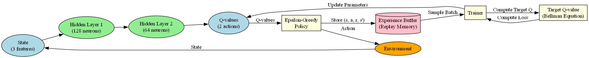

# Flappy Bird AI
This repository contains a project focused on implementing an AI agent to play Flappy Bird using reinforcement learning. Objective was to train an agent to reach the score of 100 points in the game and document the process.

The project is implemented with Python using common libraries such as **PyTorch** for machine learning and **Pygame** for the game environment.

## DQN algorithm overview
In this project, the AI agent was trained using the *Deep Q-Learning (DQN)* algorithm. The DQN algorithm combines Q-learning with deep neural networks to approximate the Q-value function. This allows the agent to estimate expected future rewards for different actions in a given state. More on this topic in the `reserach` folder.

**DQN architecture:**
 

---

## Features  
- **Flappy Bird Game Environment**:  
  - A fully functional Flappy Bird game simulation.  
  - Includes the ability to play the game manually for testing and fun.

- **AI Agent Training**:  
  - Implements the **Deep Q-Learning** algorithm to train the agent.  
  - Agent learns to play the game by interacting with the environment through trial and error. 

- **Testing and Evaluation**:  
  - Each trained agent is saved and can be tested after training.  
  - Agent's performance is visualized in the game environtment and as a graph after training.
  - Functionality for recording the agent's learning and gameplay is implemented in the project.

---

## Installation and usage
Tested to work on Python 3.11 or higher.

1. Clone this repository:  
   ```bash  
   git clone https://github.com/arnotoro/flappy-ai.git  
   cd flappy-ai
   ```
2. Install the required dependencies:
   ```bash  
   pip install -r requirements.txt  
   ```
3. (Optional) Run the game manually to test the environment:
   ```bash  
   python play.py  
   ```
4. To train an agent, run the following command:
   ```bash  
   python train.py  
   ```
    Parameters to tune can be found in the `train.py` file. 

5. To test a trained agent, run the following command:
   ```bash  
   python load_model.py --model <path_to_model>  
   ```
   Replace `<path_to_model>` with the path to the trained model file. The model files are saved in the `models` folder after training.