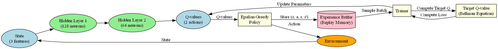

# Flappy Bird AI   
This repository contains a course project focused on training an AI agent to play Flappy Bird using reinforcement learning. The agent leverages the **Deep Q-Learning (DQN)** algorithm to optimize its gameplay. The project is implemented using common Python libraries such as **PyTorch** for machine learning and **Pygame** for creating the game environment.  

---

## Features  
- 🎮 **Flappy Bird Game Environment**:  
  - A fully functional Flappy Bird game simulation.  
  - Includes the ability to play the game manually for comparison.  

- 🤖 **AI Agent Training**:  
  - Implements the **Deep Q-Learning** algorithm to train the agent.  
  - Supports continuous learning through trial-and-error interactions with the environment.  
  - Supports saving and loading trained models for future use.

- 🧪 **Testing and Evaluation**:  
  - Tools to test the agent's performance after training.  
  - Visualizes progress with performance metrics and graphs.
  - Ability to record the agent's learning and gameplay.

---

## Deep Q-Learning Algorithm Overview  
The Deep Q-Learning (DQN) algorithm enables the AI agent to make decisions by approximating the Q-value function, which predicts the future reward for a given state-action pair.  

**DQN Architecture:**  
  

--- 

## Getting Started
Tested on Python 3.11.8
1. Clone this repository:  
   ```bash  
   git clone https://github.com/arnotoro/flappy-ai.git  
   cd flappy-ai
   ```
2. Install the required dependencies:
   ```bash  
   pip install -r requirements.txt  
   ```
3. Run the Flappy Bird game:  
   ```bash
    python main.py
    ```
